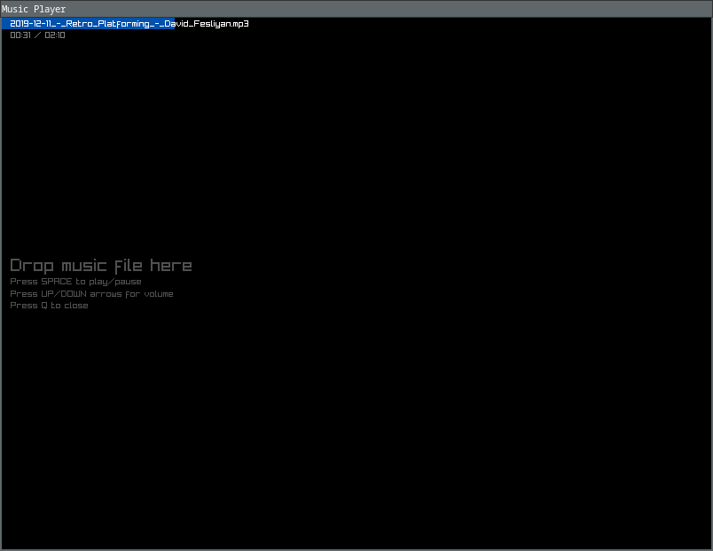

# musicplayer
A **simple** C music player

My primary objective with this project is to craft an application with minimal dependencies, 
with focus on memory management and structured programming best practices.

At the moment, the project relies solely on raylib for window management and UI event handling. 
I'm designing all graphical elements from the ground up, utilizing raylib's simple shape capabilities.

### How to build
On a terminal, execute: `./build.sh`

### How to run
On a terminal, execute: `./player`

## (Simple) Features
- Drag & Drop to load music files
- Show music duration and time played
- Play / Pause
- Volume control

## Dependecies
- [raylib](https://www.raylib.com/)
